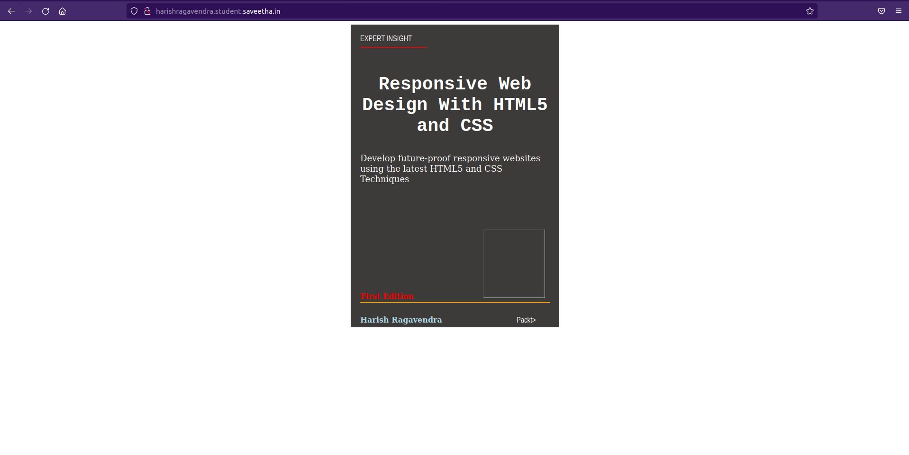

aim: create a cover page design using html and css

design steps:

step1:
start a django project and create a app for project

step2:
change the settings and a app in installed apps

step3:
create a html file in templates folder

step4:
map the views and urls for the html file

step5:
push the code to github

# cover-page-design
```
<!DOCTYPE html>
<html>
    <head>
        <title>book page cover</title>
        <style>
            body{
                background: url('mybook/static/images/transparent_picture.png');
            }
        </style>
    </head>
    <body>
        <style>

    .bookpage{
        width: 400px;
        height: 600px;
        background-color: #3d3a3a;
        color:white;
        margin-left: auto;
        margin-right: auto;
        padding: 20px;
        font-family: 'Franklin Gothic Medium', 'Arial Narrow', Arial, sans-serif;
        background-image: url(/static/images/6.jpg);
        background-size: cover;
    }
        

    .toptext{
        color:white;

    }

    
    .tophr{
        width:140px;
    }
    .author{
        color: white;
        display: inline;
        position: relative;
        color:lightblue;
        top:190px;
        
        font-family:Georgia;
        font-size: medium;
    }
    .booktitle{
        font-family: 'Courier New', Courier, monospace;
        font-size: larger;
        text-align: center;
        position: relative;
        top: 30px;
    
    }
    .id {
        width:400px;
        position: relative;
        top:180px;
        
    }
    .publisher{
        font-size: medium;
        position: relative;
        top:155px;
        left:330px;
    }
    .edition{
        color:red;
        font-size: medium;
        font-family: Verdana;
        position:relative;
        top:85px;

    }
    .subtitle{
        font-family:Tahoma;
        font-size: large;
        position: relative;
        top:40px;
    }
    .photo{
        position: relative;
        top: 135px;
        left: 260px;
        width: 100px;
        height: 100px;
        background-size: cover;
    }
    </style>
    <title>Book Cover Page</title>
</head>
<body>
    <div class="bookpage">
        <div class="toptext">
            EXPERT INSIGHT
        </div>
        <div class="tophr">
            <hr style="color: red;">
        </div>
        <div class="booktitle">
            <h1>Responsive Web Design With HTML5 and CSS</h1></div>
        <div class="subtitle">
            Develop future-proof responsive websites using the latest HTML5 and CSS Techniques
        </div>
        <div class="photo">
            
        </div>
        <div class="id">
            <hr style="color: orange;">
        </div>
        <div class="author">
           <p><b>Harish Ragavendra</b></p>
        </div>
        <div class="publisher">
            Packt>
        </div>
        <div class="edition">
            <b>First Edition</b>
        </div>
        
    </div>
</body>


        
    </body>
</html>
output:

result:
thus the experiment executed sucessfully
